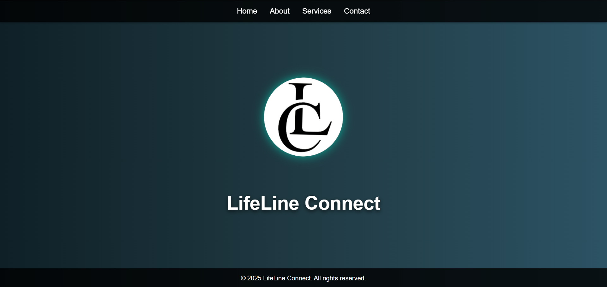
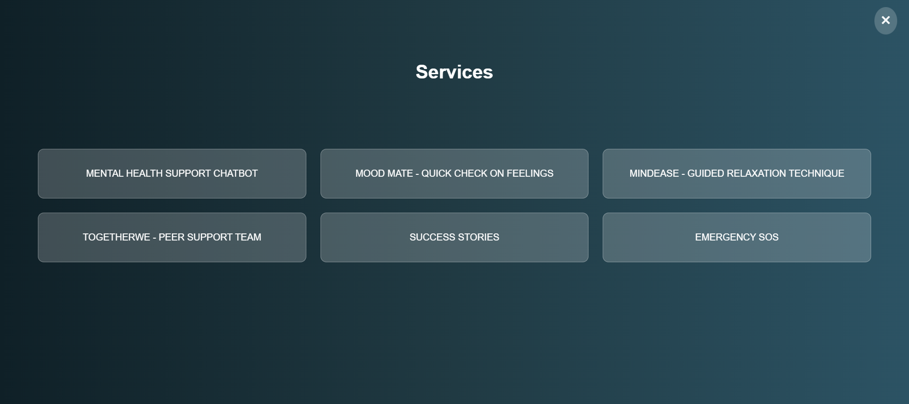

# LifeLine Connect 🌟

[](https://opensource.org/licenses/MIT)


A mental health support platform providing immediate assistance through AI chatbots, mood tracking, peer support, and emergency resources.

 <br/>


## ✨ Features

### Mental Health Support Chatbot
- 24/7 AI-powered emotional support
- Confidential conversations
- Crisis detection & redirection

### Mood Mate
- Quick emotional check-ins
- Visual mood tracking
- Personalized coping suggestions

### MindEase
- Guided motivation tips
- Curated relaxation techniques
- Soothing visual therapy

### TogetherWe (Peer Support)
- Anonymous peer matching
- Safe community forums
- Verified mental health advocates

### Success Stories
- 

### Emergency SOS
- One-tap crisis helplines
- Location-based emergency contacts
- Quick-access safety plans


## 🗣️Deployment

To deploy this project in your local system, run:
```bash
gh repo clone amritrv2604/LifeLine-Connect
```


## 🛠️ Tech Stack

- Frontend: HTML5, CSS3, JavaScript
- Animations: GSAP, Three.js
- Form Handling: FormSubmit.co
- Responsive Design: Mobile-first CSS


## 🌐 Live Demo
Try LifeLine Connect Now https://lifeline-connect.vercel.app/


## 🤝 How to Contribute
- Fork the project
- Create your branch (git checkout -b feature/AmazingFeature)
- Commit changes (git commit -m 'Add amazing feature')
- Push (git push origin feature/AmazingFeature)
- Open a Pull Request


## 📜 License
Distributed under MIT License. See LICENSE for more information.


## 💖 Contributors
<table> 
  <tr> 
    <td align="center"> <a href="http://github.com/amritrv2604">  <br /> <sub><b style="text-decoration:none;">Amrit Raj</b></sub> </a> </td>
    <td align="center"> <a href="https://github.com/ravibhushan293">  <br /> <sub><b>Ravi Bhushan</b></sub> </a</td>     <td align="center"> <a href="https://github.com/Aditya9354">  <br /> <sub><b>Aditya Prakash</b></sub> </a</td>     <td align="center"> <a href="https://github.com/mozammilalam12">  <br /> <sub><b>Mozammil Alam</b></sub> </a></td>   
  </tr>
</table>
